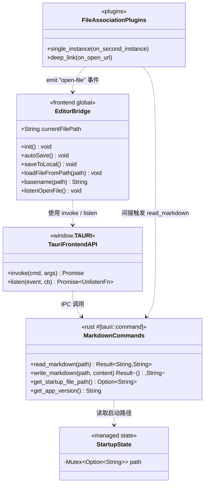
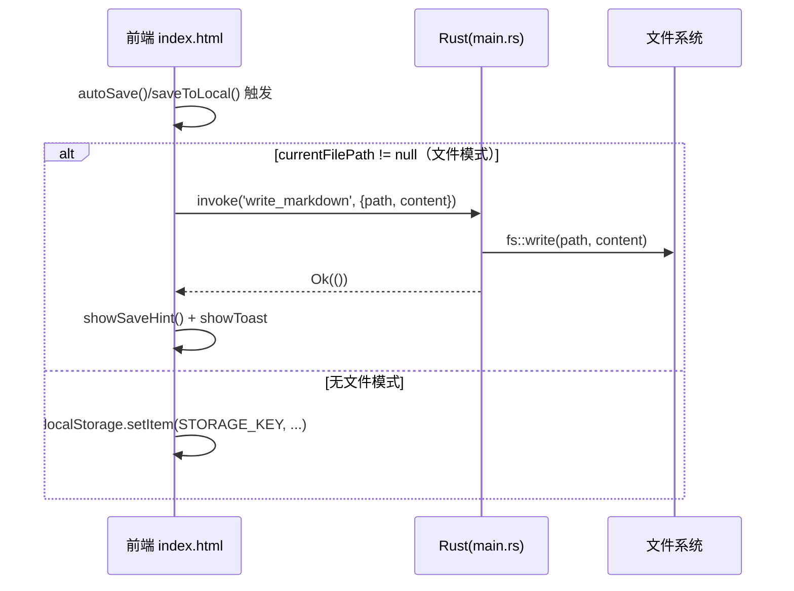
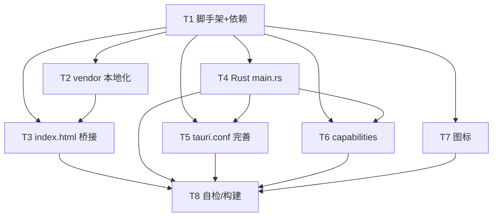

# MD Editor → Tauri v2 Windows 桌面安装包 · 系统架构设计 + 任务分解

> 作者：高见远（架构师）　|　阶段：SOP 第一阶段（交付工程师实现）　|　日期：2025
> 范围：把 `D:\pypro\md-editor` 的纯前端单文件 Markdown 编辑器封装为 **Tauri v2 + Windows (.exe / NSIS)** 桌面应用。
> 原则：**最小改动、功能不变、离线可用、原文件不动**。

---

## 0. 现状速读（已 grep 确认）

| 项 | 结论 |
|---|---|
| 主程序 | `markdown-editor.html`（约 2900 行，HTML+CSS+原生 JS，无框架） |
| 多语言 | `i18n.js`（10 国语言字典，被 html 以 `<script src="i18n.js">` 引入） |
| 第三方库 | **全部走 CDN（jsdelivr）**，离线不可用：`marked`(未锁版)、`katex@0.16.9`(js+css+auto-render)、`mermaid@10`、`dom-to-image-more@3.5.0` |
| 状态存储 | `localStorage`，键：`md_editor_content` / `md_editor_filename`（对应源码 `STORAGE_KEY` / `FILENAME_KEY`） |
| 自动保存 | `autoSave()`（1790 行）：每 500ms 写 `localStorage` |
| 手动保存 | `saveToLocal()`（1806 行）：写 `localStorage` + toast（**仅存缓存，不写磁盘**） |
| 导出 | `exportFile()`（1814 行）：`Blob` 浏览器下载 `.md`；另有 `exportWord/exportHTML/exportPDF/exportImage` |
| 文件名 | 顶部输入框 `#filename`（`filenameInput`），约 1053 行 |
| 导入/拖拽 | `importFile(input)`（2175 行）→ `loadFile(file)`（2157 行，FileReader）；拖拽 `drop` 事件（3142 行）共用 `loadFile` |
| 初始化 | `init()`（1611 行）：读 `localStorage` 恢复内容/文件名/主题/布局 |

---

## 1. 实现方案 + 框架版本

### 1.1 技术选型

| 维度 | 选择 | 理由 |
|---|---|---|
| 框架 | **Tauri v2** | 最轻量，Windows 复用系统 WebView2，安装包仅几 MB（对比 Electron 上百 MB） |
| 语言 | Rust（edition **2021**）写命令层；前端保持原生 JS | 不引入打包器，最小改动 |
| 前端策略 | **无打包器 + `withGlobalTauri: true`** | 保持 `markdown-editor.html` 为纯 `<script>` 全局脚本；通过 `window.__TAURI__.core.invoke` / `window.__TAURI__.event.listen` 调用 Rust，避免引入 Vite/ESM 改造，改动面最小 |
| 离线 | **vendor 本地化** marked/katex/mermaid/dom-to-image-more + katex 字体 | 把 CDN 文件下载进 `app/vendor/`，`index.html` 改引用本地路径 |
| 安装包 | NSIS（`bundle.targets: ["nsis"]`） | Windows 标准 `.exe` 安装器，支持文件关联注册表写入 |
| 文件关联 | `bundle.fileAssociations` + **single-instance + deep-link** 插件 | 见下 |

### 1.2 精确版本（版本锁定）

**Cargo（`app/src-tauri/Cargo.toml`）**

```toml
[package]
name = "md-editor"
version = "1.0.0"
edition = "2021"
rust-version = "1.77"   # Tauri 2 最低要求

[dependencies]
tauri = { version = "2", features = ["protocol-asset"] }   # 取安装时最新 2.x，随后提交 Cargo.lock 锁定
tauri-plugin-single-instance = { version = "2", features = ["deep-link"] }  # 关键：启用 deep-link 特性，让文件/URL 打开路由到单实例
tauri-plugin-deep-link = "2"
serde = { version = "1", features = ["derive"] }
serde_json = "1"
```

> 说明：`tauri = "2"` 会解析为最新 2.x 次版本。脚手架完成后**必须提交 `Cargo.lock`** 锁定确切版本，保证可复现构建。Rust crate 用 `"2"` 而非 `"^2"`（Cargo 惯例）。

**npm（`app/package.json`，仅 devDependencies）**

```jsonc
{
  "name": "md-editor-desktop",
  "version": "1.0.0",
  "private": true,
  "scripts": {
    "tauri": "tauri",
    "dev": "npx @tauri-apps/cli dev",
    "build": "npx @tauri-apps/cli build",
    "icon": "npx @tauri-apps/cli icon src-tauri/icons/icon-source.png"
  },
  "devDependencies": {
    "@tauri-apps/cli": "^2",          // 构建/运行 CLI（也可 cargo install tauri-cli 全局安装）
    "vite": "^5"                       // 仅作开发期静态服务器（不打包，原样伺服 index.html）
    // 以下仅在“改用 ES module 引入 @tauri-apps/api”时才需要，默认方案用 window.__TAURI__ 可省略：
    // "@tauri-apps/api": "^2",
    // "tauri-plugin-single-instance": "^2",
    // "tauri-plugin-deep-link": "^2"
  }
}
```

### 1.3 为什么用 deep-link + single-instance 处理 .md 双击（Windows 路径）

官方文档已确认（Tauri v2 深度链接文档）：
> “在 Linux 和 Windows 上，深度链接**作为命令行参数**传递给新的应用进程。如果你希望单个应用实例接收事件，深度链接插件已与 single instance 插件集成。”

因此 Windows 下双击 `.md` 的完整链路是：

1. **NSIS 安装时**写注册表：`HKEY_CLASSES_ROOT\.md` / `.markdown` → 关联 `md-editor` → 打开命令 `app.exe "%1"`。
2. **用户双击** → Windows 启动新进程 `app.exe "C:\path\a.md"`。路径以**命令行参数**形式传入。
3. **两种情形**：
   - **App 未运行（首次）**：`main.rs` 在 `std::env::args()` 中读到 `.md` 路径 → 存入 `StartupState` → 前端 `init()` 通过 `invoke('get_startup_file_path')` 取得并 `invoke('read_markdown')` 载入。
   - **App 已运行（再次双击另一文件）**：Windows 又会启动 `app.exe "C:\path\b.md"`。若无 single-instance，会多开一个进程/窗口。**single-instance 插件拦截第二次启动**，在其 `on_second_instance(args)` 回调里解析到 `.md` 路径，向已运行实例的主窗口 `emit('open-file', {path})`，前端 `listen('open-file')` 接收并载入。同时把窗口 `show()/set_focus()`，体验上是“在已开窗口里打开新文件”。
4. **deep-link 插件**的价值：
   - 它是 Tauri 官方的“用文件/URL 打开”统一抽象；其 `deep-link` 特性被挂到 single-instance 上（`features = ["deep-link"]`），使文件/URL 打开事件统一收敛到单实例。
   - 额外支持自定义 URI 协议 `md-editor://...`（`on_open_url` 回调），未来可扩展；该路径下也走同一 `open-file` 事件。
   - **注意**：Windows 文件关联双击走的是「参数（argv）」而非 URI，故前端**核心只依赖 `invoke` + `listen`**（均为 `withGlobalTauri` 原生提供），deep-link 的 JS API 在本方案为可选增强。

> 结论：single-instance 负责“只跑一个实例 + 把后续双击转发给已运行窗口”；deep-link 负责“官方统一的打开语义 + URI scheme + 与单实例集成”。二者配合，双击 `.md` 在“首启/已运行”两种情况下都能正确打开文件。

---

## 2. 文件列表（相对 `app/`）

```
app/
├── package.json                       # npm 声明（devDeps + 脚本）
├── .gitignore                         # 忽略 node_modules / target / src-tauri/target
├── index.html                         # ★ 由 markdown-editor.html 副本改造（CDN→vendor、localStorage 分支→文件读写）
├── i18n.js                            # 原样复制（10 国语言，109KB）
├── vendor/                            # ★ 本地化第三方库（离线可用）
│   ├── marked/marked.min.js
│   ├── katex/
│   │   ├── katex.min.css
│   │   ├── katex.min.js
│   │   ├── contrib/auto-render.min.js
│   │   └── fonts/                     # ★ KaTeX 字体（woff2），katex.min.css 以相对路径引用
│   │       ├── KaTeX_*.woff2
│   ├── mermaid/mermaid.min.js
│   └── dom-to-image-more/dom-to-image-more.min.js
└── src-tauri/
    ├── Cargo.toml                     # Rust 依赖（版本见 §1.2）
    ├── build.rs                       # Tauri 构建脚本（默认内容）
    ├── tauri.conf.json                # ★ 应用配置（bundle/fileAssociations/nsis/windows/withGlobalTauri/csp）
    ├── src/main.rs                    # ★ Rust 入口：命令 + 插件 + 启动参数解析 + 事件转发
    ├── capabilities/default.json      # ★ 权限：放行自定义命令 + 事件 + 核心权限
    └── icons/
        ├── icon-source.png            # 占位源图（Python 脚本生成，带“MD”字样）
        ├── icon.ico / icon.png / 32x32.png / 128x128.png / 128x128@2x.png
        ├── Square30x30Logo.png / Square70x70Logo.png / Square150x150Logo.png / StoreLogo.png
        └── md-file.ico                # 文件关联图标（.md 在资源管理器里的图标）
```
> `icons/` 中除 `icon-source.png` 外，均由 `npx @tauri-apps/cli icon icon-source.png` 自动生成。

---

## 3. 数据结构与接口（Bridge 契约）

### 3.1 前端需改动/新增（基于 `index.html`）

新增全局状态与函数（建议加在 `<script>` 顶部、其它函数之前）：

```js
// ===== Tauri Bridge（新增）=====
const TAURI = window.__TAURI__;                 // withGlobalTauri 注入
let currentFilePath = null;                     // null=无文件模式；string=已打开文件的绝对路径

function basename(p) { return (p || '').split(/[\\/]/).pop(); }

async function loadFileFromPath(p) {
  try {
    const content = await TAURI.core.invoke('read_markdown', { path: p });
    currentFilePath = p;
    editor.value = content || '';
    filenameInput.value = basename(p);
    updatePreview(); updateCount();
    showToast(t('toastFileOpened'));
  } catch (e) {
    showToast(t('toastOpenFailed') + ': ' + e);
  }
}

// 注册“后续打开请求”监听（已运行实例收到 single-instance/deep-link 转发时触发）
TAURI.event.listen('open-file', (ev) => loadFileFromPath(ev.payload.path));
```

`init()`（约 1611 行）**替换原 localStorage 读取分支**为：

```js
async function init() {
  const savedLang = localStorage.getItem(LANG_KEY);
  if (savedLang && i18n[savedLang]) currentLang = savedLang;

  // —— 新增：优先用启动文件路径（来自双击 .md）——
  const startupPath = await TAURI.core.invoke('get_startup_file_path');
  if (startupPath) {
    currentFilePath = startupPath;
    try {
      const content = await TAURI.core.invoke('read_markdown', { path: startupPath });
      editor.value = content || '';
    } catch (e) { editor.value = ''; showToast(t('toastOpenFailed') + ': ' + e); }
    filenameInput.value = basename(startupPath);
  } else {
    // —— 原逻辑不变（无文件模式）——
    const saved = localStorage.getItem(STORAGE_KEY);
    if (saved !== null) editor.value = saved; else editor.value = i18n[currentLang].welcomeDoc;
    filenameInput.value = localStorage.getItem(FILENAME_KEY) || t('filenameDefault');
  }
  // 主题 / mermaid 初始化 / ratio / pane / previewMode / history 等原逻辑全部保留 ……
}
```

`autoSave()`（1790 行）改为按模式分支：

```js
function autoSave() {
  clearTimeout(saveTimer);
  saveTimer = setTimeout(() => {
    if (currentFilePath) {                              // 文件模式：真正写磁盘
      TAURI.core.invoke('write_markdown', { path: currentFilePath, content: editor.value })
        .then(showSaveHint)
        .catch(e => showToast(t('toastSaveFailed') + ': ' + e));
    } else {                                            // 无文件模式：保持原 localStorage 行为
      localStorage.setItem(STORAGE_KEY, editor.value);
      localStorage.setItem(FILENAME_KEY, filenameInput.value);
      showSaveHint();
    }
  }, 500);
}
```

`saveToLocal()`（1806 行）同样分支：

```js
function saveToLocal() {
  if (currentFilePath) {
    TAURI.core.invoke('write_markdown', { path: currentFilePath, content: editor.value })
      .then(() => { showSaveHint(); showToast(t('toastSaved')); })
      .catch(e => showToast(t('toastSaveFailed') + ': ' + e));
  } else {
    localStorage.setItem(STORAGE_KEY, editor.value);
    localStorage.setItem(FILENAME_KEY, filenameInput.value);
    showSaveHint(); showToast(t('toastSaved'));
  }
}
```

**保持不变的函数**（明确列出，工程师勿动）：`exportFile` / `exportWord` / `exportHTML` / `exportPDF` / `downloadExportImage` / `importFile` / `loadFile`（导入、拖拽共用）/ `toggleTheme` / `clearDoc` / 全部格式化与 UI 函数 / 多语言 `t()` / `i18n.js`。

> ⚠️ 边界约定（见 §8）：导入(`loadFile`)、拖拽、清空(`clearDoc`)保持原逻辑；但为避免“在文件模式下导入/清空误写磁盘”，推荐在 `loadFile`/`clearDoc` 开头置 `currentFilePath = null`（转为无文件模式，内容进 localStorage），详见 §8 待明确事项。

### 3.2 Rust 需暴露的命令（`main.rs`）

```rust
#[tauri::command]
fn read_markdown(path: String) -> Result<String, String> {
    std::fs::read_to_string(&path).map_err(|e| format!("读取文件失败: {e}"))
}

#[tauri::command]
fn write_markdown(path: String, content: String) -> Result<(), String> {
    std::fs::write(&path, content).map_err(|e| format!("写入文件失败: {e}"))
}

#[tauri::command]
fn get_startup_file_path(state: State<StartupState>) -> Option<String> {
    state.0.lock().unwrap().clone()
}

#[tauri::command]
fn get_app_version() -> String {
    env!("CARGO_PKG_VERSION").to_string()   // 可选
}
```

注册：`invoke_handler(tauri::generate_handler![read_markdown, write_markdown, get_startup_file_path, get_app_version])`

### 3.3 类图（Bridge 契约）



---

## 4. 程序调用流程（时序图）

### 4.1 双击 .md → 打开文件（首次 / 已运行两种情形）

```mermaid
sequenceDiagram
    participant OS as Windows 资源管理器
    participant Proc as app.exe 进程
    participant Rust as Rust(main.rs)
    participant FE as 前端 index.html

    OS->>Proc: 双击 a.md → 启动 app.exe "C:/a/file.md"

    alt 首次启动（无运行实例）
        Proc->>Rust: std::env::args() 含 "C:/a/file.md"
        Rust->>Rust: 解析并写入 StartupState
        Rust->>FE: 创建窗口、加载 index.html
        FE->>Rust: invoke('get_startup_file_path')
        Rust-->>FE: "C:/a/file.md"
        FE->>Rust: invoke('read_markdown', {path})
        Rust->>Rust: fs::read_to_string
        Rust-->>FE: content
        FE->>FE: editor.value=content; filenameInput=basename
    else 已运行实例（再次双击 b.md）
        OS->>Proc: 新进程 app.exe "C:/b/file.md"
        Proc->>Rust: single_instance.on_second_instance(args)
        Rust->>FE: window.emit('open-file', {path:"C:/b/file.md"})
        FE->>FE: listen('open-file') → loadFileFromPath
        FE->>Rust: invoke('read_markdown', {path})
        Rust-->>FE: content
        FE->>FE: 填充编辑器 + showToast
    end
```

### 4.2 保存文件



---

## 5. 任务列表（有序、含依赖）

> 按交付要求细化为 **8 个有序步骤（T1–T8）**；为兼顾“单文件/模块化分组”的工程习惯，末附 **5 个实施阶段映射**（每阶段 ≥3 文件）。工程师按 T1→T8 顺序执行即可。

### 5.1 详细步骤（依赖 + 优先级）

| ID | 任务 | 源文件 | 依赖 | 优先级 |
|---|---|---|---|---|
| **T1** | 脚手架 + 依赖声明 | `package.json`, `src-tauri/Cargo.toml`, `src-tauri/build.rs`, `src-tauri/tauri.conf.json`(骨架), `.gitignore` | — | P0 |
| **T2** | vendor 库下载/本地化 | `vendor/marked/marked.min.js`, `vendor/katex/*`, `vendor/mermaid/mermaid.min.js`, `vendor/dom-to-image-more/dom-to-image-more.min.js` | T1 | P0 |
| **T3** | 改造 `index.html` 桥接 | `index.html`(复制自 markdown-editor.html), `i18n.js` | T1, T2 | P0 |
| **T4** | Rust `main.rs` + 命令 + 插件 | `src-tauri/src/main.rs` | T1 | P0 |
| **T5** | 完善 `tauri.conf.json`（bundle/fileAssociations/nsis/icon/csp） | `src-tauri/tauri.conf.json` | T1, T4 | P1 |
| **T6** | capabilities 权限 | `src-tauri/capabilities/default.json` | T1, T4 | P0 |
| **T7** | 图标（占位 + 生成全套） | `src-tauri/icons/icon-source.png` + 生成物, `src-tauri/icons/md-file.ico` | T1 | P1 |
| **T8** | 自检 / 构建 / 验证 | 全部（构建产物 `app/src-tauri/target/release/`、`nsis` 安装包） | T2,T3,T4,T5,T6,T7 | P0 |

### 5.2 依赖关系图



### 5.3 实施阶段映射（≤5 组，便于并行/评审）

- **阶段 A（基础设施）** = T1：配置文件 + 入口 + 依赖声明（一次性打完地基）。
- **阶段 B（前端 + 资源）** = T2 + T3：vendor 本地化 + `index.html` 桥接改造（可并行于阶段 C）。
- **阶段 C（Rust 内核）** = T4：命令与插件。
- **阶段 D（配置收尾）** = T5 + T6 + T7：`tauri.conf.json` 完整化、capabilities、图标。
- **阶段 E（构建验收）** = T8：联调、构建 NSIS、双击验证。

---

## 6. 依赖包列表

### npm（`app/package.json` devDependencies）
```
- @tauri-apps/cli@^2        : Tauri 构建/运行 CLI（dev/build 命令）
- vite@^5                   : 开发期静态服务器（仅伺服，不打包；可选，也可用 python -m http.server 替代）
# 以下可选，仅当改用 ES module 引入 @tauri-apps/api 时需要：
# @tauri-apps/api@^2
# tauri-plugin-single-instance@^2
# tauri-plugin-deep-link@^2
```

### cargo（`app/src-tauri/Cargo.toml`）
```
- tauri@2                         : 核心框架（edition 2021）
- tauri-plugin-single-instance@2 : 单实例（features=["deep-link"]）
- tauri-plugin-deep-link@2        : 深度链接/文件关联统一入口
- serde@1 (features=["derive"])   : 命令参数/状态序列化
- serde_json@1                    : 事件 payload
```

> 系统要求：Windows 10/11 + **WebView2 Runtime**（系统已自带或随应用分发）；Rust 工具链 ≥ 1.77；建议 `cargo install tauri-cli` 或全程用 `npx @tauri-apps/cli`。

---

## 7. 共享知识（跨文件约定）

1. **`currentFilePath` 语义**：`null` = 无文件模式（内容与文件名存 `localStorage`，行为同原版）；非空字符串 = 文件模式（绝对路径，`autoSave`/`saveToLocal` 真正写磁盘）。
2. **路径 ↔ `file://` 互转**：Windows 双击大多传 `C:\a.md`（无前缀）；个别启动器传 `file:///C:/a.md`。Rust 侧统一规范化：`trim_start_matches("file:///")` 并把 `/` 替换为 `\`。前端 `basename()` 仅用于文件名显示，保存仍以 `currentFilePath` 为准。
3. **编码统一 UTF-8**：`read_markdown`/`write_markdown` 均用 `fs::read_to_string`/`fs::write`（UTF-8）。原 `exportFile` 也用 `charset=utf-8`，一致。
4. **错误提示文案**（建议 i18n 新增 key）：`toastFileOpened`(文件已打开)、`toastOpenFailed`(打开失败)、`toastSaveFailed`(保存失败)。Rust 返回 `Err(String)`，前端 `catch` 后 `showToast(... + e)`。
5. **capabilities 必须放行**：自定义命令 `read_markdown`/`write_markdown`/`get_startup_file_path`（权限标识 `<identifier>:allow-<cmd>`）、`core:event`（listen）、`core:default`、`core:window:default`。否则前端 `invoke`/`listen` 会被拒绝。
6. **`withGlobalTauri: true`** 是前端免打包器的前提；前端一律通过 `window.__TAURI__.core.invoke` / `window.__TAURI__.event.listen` 通信。
7. **CSP**：因 `index.html` 含内联脚本与本地 `vendor/*.js`，`app.security.csp` 需允许 `script-src 'self' 'unsafe-inline'`、`style-src 'self' 'unsafe-inline'`、`img-src 'self' data: blob:`、`font-src 'self' data:`、`connect-src 'self' ipc: http://ipc.localhost`（见 §9）。本地静态伺服下也可临时设 `csp: null`，但生产建议保留显式策略。
8. **原文件保护**：所有改动只在 `app/` 子目录；`D:\pypro\md-editor\markdown-editor.html` / `i18n.js` **不得修改**，`app/index.html` 是其副本改造。
9. **`filenameInput` 与文件名的区别**：文件模式下 `currentFilePath` 是保存目标（权威）；`filenameInput.value` 仅用于显示与“导出”命名。修改 `filenameInput` 文本**不会**重命名磁盘文件（超出范围）。

---

## 8. 待明确事项 / 假设（已给推荐）

| # | 事项 | 推荐方案 |
|---|---|---|
| A | 首次启动无文件时显示什么 | **空白新文档**（同原行为：读不到启动路径则用 `localStorage`/欢迎语）。保持原版。 |
| B | 图标 | 用 Python 脚本生成带“MD”字样的占位 `icon-source.png`，再 `tauri icon` 生成全套；后续可替换为正式设计。**不阻塞**功能开发。 |
| C | single-instance 下重复双击 .md | **在已运行窗口打开该文件**（emit `open-file` + `show/set_focus`），不开新窗口。符合“单实例编辑器”直觉。 |
| D | 导入/拖拽时若处于文件模式 | 推荐在 `loadFile()` 开头置 `currentFilePath = null`，使导入内容进入“无文件模式”（存 localStorage），避免误覆盖正在编辑的磁盘文件；保持“导入=载入内容”的原语义。 |
| E | `clearDoc()` 清空 | 同上，推荐清空前置 `currentFilePath = null`，清空仅影响内存与 localStorage，不误删磁盘文件。 |
| F | `marked` 原 CDN 未锁版本 | 下载时记录 jsdelivr 实际解析到的版本号（如 `marked@12.x`），写入 `vendor/marked/` 文件名或注释；若预览渲染异常，对照原版 CDN 实际版本调整。 |
| G | 导出（`exportFile/Word/HTML/PDF/Image`）在 WebView2 中的下载行为 | 保持原 Blob `a.download` 逻辑不变。WebView2 支持 blob 下载；若出现不触发下载的情况，再补一个 `save_dialog` Rust 命令兜底（**本期不做**，留作已知风险）。 |
| H | `index.html` 中 `exportWord` 内嵌的两条 katex CDN 引用（1909/1938-1939 行，在导出的 .doc 文档里） | 属“导出文件自带样式”，不影响应用离线运行；**本期保留 CDN**。如需严格离线导出，后续改为内联或本地引用。 |
| I | 写文件是否自动建父目录 | **不建**（保持简单）。路径来自已存在的 `.md` 文件，父目录必然存在。 |

---

## 9. 关键配置示例

### 9.1 `src-tauri/tauri.conf.json`（核心片段）

```jsonc
{
  "$schema": "https://schema.tauri.app/config/2",
  "productName": "MD Editor",
  "version": "1.0.0",
  "identifier": "com-md-editor-app",          // 应用 bundle identifier（仅用于包名/窗口标识；命令权限引用时不带此前缀）
  "build": {
    "frontendDist": "../",                      // 相对 src-tauri → app/，含 index.html/i18n.js/vendor
    "devUrl": "http://localhost:5173",
    "beforeDevCommand": "npx vite --port 5173 --strictPort",
    "beforeBuildCommand": ""                    // 无打包步骤，直接嵌入 frontendDist
  },
  "app": {
    "withGlobalTauri": true,                    // ★ 前端用 window.__TAURI__，免打包器
    "windows": [
      {
        "label": "main",
        "title": "MD Editor",
        "width": 1100,
        "height": 720,
        "resizable": true,
        "fullscreen": false,
        "center": true
      }
    ],
    "security": {
      "csp": "default-src 'self'; script-src 'self' 'unsafe-inline'; style-src 'self' 'unsafe-inline'; img-src 'self' data: blob:; font-src 'self' data:; connect-src 'self' ipc: http://ipc.localhost"
      // 本地开发若仍被拦，可临时改 null
    }
  },
  "bundle": {
    "active": true,
    "targets": ["nsis"],                        // ★ 仅 Windows NSIS
    "icon": [
      "icons/icon.ico",
      "icons/icon.png",
      "icons/32x32.png",
      "icons/128x128.png",
      "icons/128x128@2x.png",
      "icons/Square30x30Logo.png",
      "icons/Square70x70Logo.png",
      "icons/Square150x150Logo.png",
      "icons/StoreLogo.png"
    ],
    "fileAssociations": [                       // ★ .md / .markdown 关联
      {
        "ext": ["md", "markdown"],
        "name": "Markdown Document",
        "description": "Markdown 文档",
        "role": "Editor",
        "icon": ["icons/md-file.ico"]
      }
    ],
    "nsis": {
      "displayLanguageSelector": true,
      "languages": ["SimpChinese", "English"],
      "installMode": "perUser",
      "shortcutName": "MD Editor"
    }
  }
}
```

### 9.2 `src-tauri/capabilities/default.json`（关键权限）

```jsonc
{
  "$schema": "../gen/schemas/desktop-schema.json",
  "identifier": "default",
  "description": "MD Editor 默认能力",
  "windows": ["main"],
  "permissions": [
    "core:default",
    "core:event:default",          // 允许 listen / emit（open-file 事件）
    "core:window:default",
    "core:app:default",
    "core:webview:default",
    // ★ 自定义命令（应用自身权限不带 identifier 前缀，直接 allow-<cmd>）
    "allow-read-markdown",
    "allow-write-markdown",
    "allow-get-startup-file-path",
    "allow-get-app-version"
  ]
}
```
> 应用自身命令权限在 `capabilities` 里**不带 identifier 前缀**直接写 `allow-<cmd>`（前缀仅用于插件）。本项目在 `src-tauri/permissions/default.toml` 手动定义这 4 个权限（Tauri 2 对 app 命令的自动生成在本工程未生效，手动定义最稳妥）。

### 9.3 `src-tauri/src/main.rs`（关键骨架）

```rust
#![cfg_attr(not(debug_assertions), windows_subsystem = "windows")]

use std::sync::Mutex;
use tauri::{Emitter, Manager, State};

// 启动路径：首次启动从 argv 解析后存入，前端 get_startup_file_path 读取
struct StartupState(pub Mutex<Option<String>>);

#[tauri::command]
fn read_markdown(path: String) -> Result<String, String> {
    std::fs::read_to_string(&path).map_err(|e| format!("读取文件失败: {e}"))
}

#[tauri::command]
fn write_markdown(path: String, content: String) -> Result<(), String> {
    std::fs::write(&path, content).map_err(|e| format!("写入文件失败: {e}"))
}

#[tauri::command]
fn get_startup_file_path(state: State<StartupState>) -> Option<String> {
    state.0.lock().unwrap().clone()
}

#[tauri::command]
fn get_app_version() -> String {
    env!("CARGO_PKG_VERSION").to_string()
}

fn is_markdown_arg(arg: &str) -> bool {
    let a = arg.to_lowercase();
    a.ends_with(".md") || a.ends_with(".markdown")
}

// 规范化路径：去掉 file:/// 前缀，把 / 换成 \
fn normalize_path(arg: &str) -> String {
    arg.trim_start_matches("file:///").replace('/', "\\")
}

fn emit_open_file(app: &tauri::AppHandle, path: String) {
    if let Some(win) = app.get_webview_window("main") {
        let _ = win.emit("open-file", serde_json::json!({ "path": path }));
    }
}

fn main() {
    // 首次启动：从命令行参数解析首个 .md 路径
    let startup_path = std::env::args()
        .skip(1)
        .find(|a| is_markdown_arg(a))
        .map(|a| normalize_path(&a));

    tauri::Builder::default()
        // ★ 单实例：已运行时再次双击 .md → 转发给运行实例
        .plugin(tauri_plugin_single_instance::init(|app, args, _cwd| {
            if let Some(p) = args.iter().find(|a| is_markdown_arg(a)) {
                emit_open_file(app, normalize_path(p));
                if let Some(win) = app.get_webview_window("main") {
                    let _ = win.show();
                    let _ = win.unminimize();
                    let _ = win.set_focus();
                }
            }
        }))
        // ★ 深度链接：官方统一打开入口（URI scheme / 与单实例集成）
        .plugin(tauri_plugin_deep_link::init())
        .manage(StartupState(Mutex::new(startup_path)))
        .setup(|app| {
            // 可选：注册自定义 URI 协议（md-editor://...），仅 URI scheme 需要
            #[cfg(desktop)]
            {
                let handle = app.handle().clone();
                tauri::async_runtime::spawn(async move {
                    let _ = tauri_plugin_deep_link::register("md-editor").await;
                });
            }
            Ok(())
        })
        .invoke_handler(tauri::generate_handler![
            read_markdown,
            write_markdown,
            get_startup_file_path,
            get_app_version
        ])
        .run(tauri::generate_context!())
        .expect("error while running tauri application");
}
```

> 注：`tauri_plugin_deep_link::init()` 若需配置 `on_open_url`，可用 `Builder::new().on_open_url(|_app, urls| { /* 解析 urls，emit open-file */ }).build()` 替代 `init()`；回调签名随插件小版本可能微调，以所装版本文档为准。本方案核心路径（argv + single-instance）不依赖该回调，故保持 `init()` 最简形态。

### 9.4 占位图标生成脚本（Python）

```python
# gen_icon.py —— 生成 app/src-tauri/icons/icon-source.png（带“MD”字样）
# 运行：python gen_icon.py   （需 Pillow：pip install pillow；无 Pillow 可用任意画图工具替代）
from PIL import Image, ImageDraw, ImageFont

W = H = 1024
img = Image.new("RGBA", (W, H), (33, 37, 41, 255))   # 深灰底
d = ImageDraw.Draw(img)
try:
    font = ImageFont.truetype("arial.ttf", 560)
except Exception:
    font = ImageFont.load_default()
d.text((W / 2, H / 2), "MD", font=font, fill=(255, 255, 255, 255), anchor="mm")
img.save("src-tauri/icons/icon-source.png")
print("icon-source.png generated")
```
生成后执行：`npx @tauri-apps/cli icon src-tauri/icons/icon-source.png` → 自动产出 `icon.ico / icon.png / 32x32.png / 128x128.png / 128x128@2x.png / Square*Logo.png` 等全套。
`md-file.ico`（文件关联图标）可复制 `icon.ico` 改名，或单独用同脚本换色生成。

---

## 10. 验收标准（交付工程师自查）

1. `npx @tauri-apps/cli build` 产出 `app/src-tauri/target/release/bundle/nsis/MD Editor_1.0.0_x64-setup.exe`。
2. 安装后双击任意 `.md` / `.markdown` → 应用启动并**载入该文件内容**（首次）；已运行时再次双击 → 在已开窗口打开（单实例）。
3. 编辑后自动保存/手动“保存”**真正写回原文件路径**（非仅 localStorage）；关闭重开仍是最新内容。
4. 断网状态下：预览（marked/katex/mermaid）、导入、导出、多语言、快捷键**全部正常**（vendor 本地化生效）。
5. 未打开文件时（直接启动应用）：行为与原始网页版一致（localStorage 草稿、欢迎语）。
6. 原 `D:\pypro\md-editor\markdown-editor.html` / `i18n.js` **未被改动**（git status 无变化）。
```
